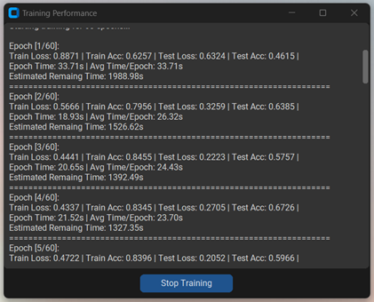
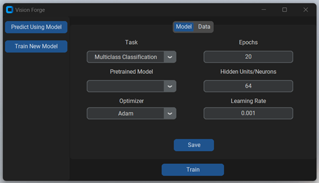
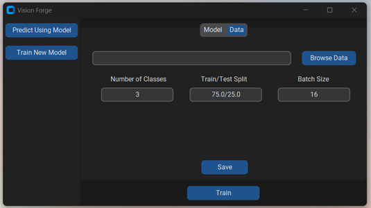
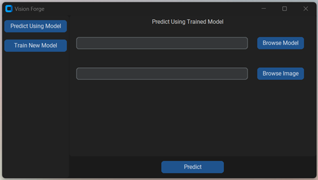

# Vision Forge

#### Video Demo: (Coming Soon)

#### Description:
Vision Forge is an intuitive application designed for creating, training, and utilizing image classification models through a user-friendly graphical user interface (GUI). This app eliminates the need for any coding, making it accessible to users of all skill levels.

### Features:
- **Custom Model Creation:** Customize your image classification models with options to select pretrained models, optimizers, epochs, hidden units/neurons, and learning rate.
- **Data Loading:** Easily load your dataset, and the app will automatically infer the number of classes and the train/test split based on the selected data folder. You can manually adjust the batch size if needed. The app manages data loading in minibatches for efficient training.
- **Data Augmentation:** Basic data augmentation transforms are included to improve model generalization. These transforms include:
    ```python
    torchvision.transforms.Compose([
        T.RandomHorizontalFlip(p=0.5),
        T.RandomVerticalFlip(p=0.25),
        T.RandomRotation(degrees=30),
        T.ColorJitter(brightness=0.2, contrast=0.2, saturation=0.2, hue=0.1)
    ])
    ```
- **Model Training:** Train your customized model with the click of a button.
- **Training Progress Window** When training starts, a window will pop up informing the user about the training progress and what's happening. Here is an example of the training progress window:
    
- **Prediction:** Use the trained model to make predictions on new images, all through the simple GUI.
- **Automatic GPU Detection** The app automatically detects if the user's PC has a GPU and utilizes it to accelerate the training process. (Ensure that PyTorch is installed with CUDA support.)
- 
### Data Folder Structure
The data folder should be structured in a specific way to ensure proper loading and training. For example, if you have a dataset named `cats_dogs`, the folder structure should look like this:

    cats_dogs/
    ├── train/
    │   ├── cat/
    │   ├── dog/
    ├── test/
    │   ├── cat/
    │   ├── dog/


### GUI Overview
Here is a preview of the GUI for your reference:

- **Model Tab:** Configure your model by selecting the task, pretrained model, optimizer, and other hyperparameters.
    
- **Data Tab:** Load your data, and the app will auto-populate the number of classes and train/test split based on the data. You can manually adjust the batch size if needed.
    
- **Prediction Tab:** Use a trained model to predict classes for new images.
    

### Getting Started
1. **Clone the repository:**
    ```bash
    git clone https://github.com/JustAnalyze/vision_forge
    cd vision-forge
    ```

2. **Install dependencies:**
    ```bash
    pip install -r requirements.txt
    ```

3. **Run the application:**
    ```bash
    python app.py
    ```

### Requirements
- Python 3.9+
- Required Python packages (listed in `requirements.txt`)

### License
This project is licensed under the MIT License - see the `LICENSE.txt` file for details.

### Acknowledgments
- **[PyTorch](https://pytorch.org/):** For providing the deep learning framework used in the model building, model training and prediction.
- **[tkinter](https://docs.python.org/3/library/tkinter.html):** For the standard GUI toolkit used to create the application interface.
- **[customtkinter](https://github.com/TomSchimansky/CustomTkinter):** For providing the enhanced tkinter widgets used to improve the GUI aesthetics and functionality.
- **[CTkMessagebox](https://github.com/Akascape/CTkMessagebox):** For providing the customizable messagebox for tkinter.
- **[matplotlib](https://matplotlib.org/):** For providing the plotting library used to visualize loss and accuracy plots.
- **[Pillow](https://python-pillow.org/):** For providing the image processing capabilities used to handle image operations.

For any questions or support, please open an issue in the repository.